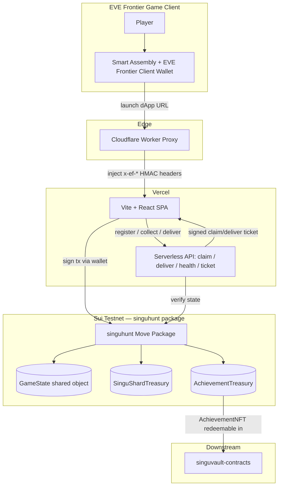

# SinguHunt App

Application repo for the SinguHunt gameplay stack on Sui testnet.

Player-facing on-chain treasure-hunt dApp on EVE Frontier × Sui · Site <https://eveuluv.me/> · Demo <https://youtu.be/DWrJCcNGC0c>

Join the Discord community at <https://discord.gg/5bGUfNngHw> to report technical issues or share suggestions.

## What Is In This Repo
- `dapp/`: Vite + React frontend plus Vercel serverless APIs for claim, deliver, health, and gate-scoped ticket routes.
- `cloudflare-proxy/`: Worker that signs trusted gate context headers before forwarding requests upstream.
- `ts-scripts/`: operational scripts for starting hunts, configuring gates, querying state, claiming achievements, and ticket verification.
- `config/gates.json`: local gate pool and required shard count.
- `move-contracts/singu-turret/`: Move package for turret-related on-chain logic.

## System Architecture

Three-tier hybrid: in-game smart assembly → Cloudflare Worker (HMAC-signed gate context) → Vercel (SPA + serverless API) → Sui testnet.



## Local Development

Frontend:

```bash
cd dapp
pnpm install
pnpm dev
```

Proxy:

```bash
cd cloudflare-proxy
npm install
cp wrangler.toml.example wrangler.toml
npm run dev
```

Scripts:

```bash
npm install
```

## Environment
- Frontend example vars live in `dapp/.env.example`.
- Root `.env` is for local TypeScript scripts and is intentionally ignored.
- `cloudflare-proxy/wrangler.toml` is no longer tracked. Create it locally from `cloudflare-proxy/wrangler.toml.example`.
- Cloudflare secret values such as `EF_CONTEXT_SHARED_SECRET` must be stored in Worker secrets, not committed.

## Notes
- This repo currently targets Sui testnet.
- Gate routes and assembly IDs are configured through `config/gates.json` and the proxy config.

## License

Copyright (c) Eve U Luv Me. All rights reserved.
This repository is proprietary and unlicensed for public reuse.
